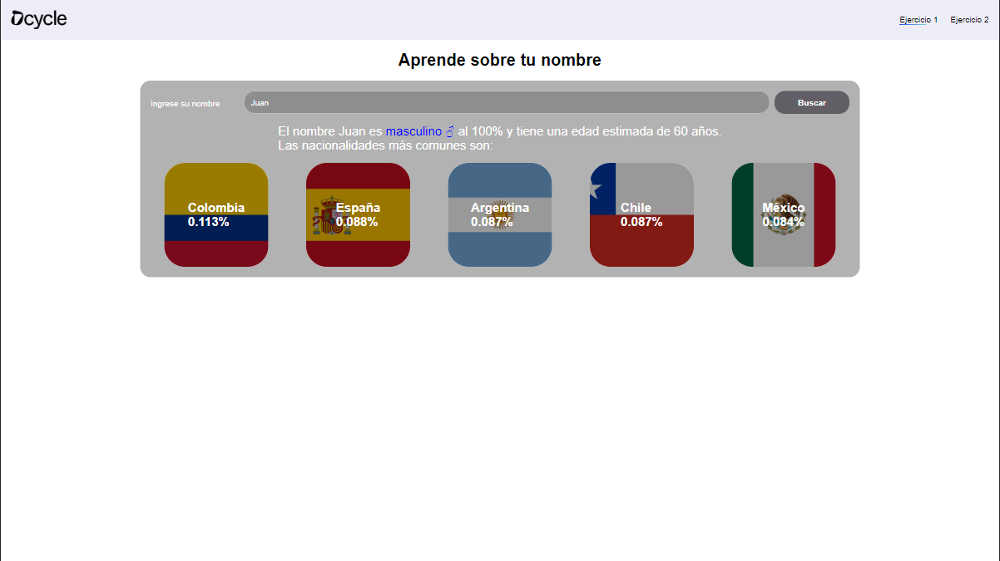
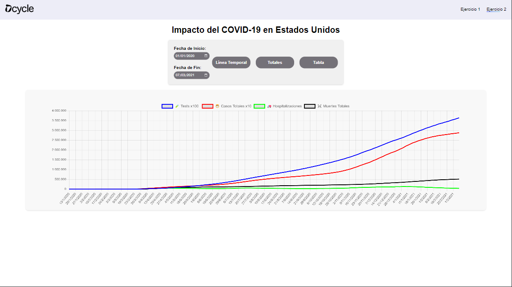
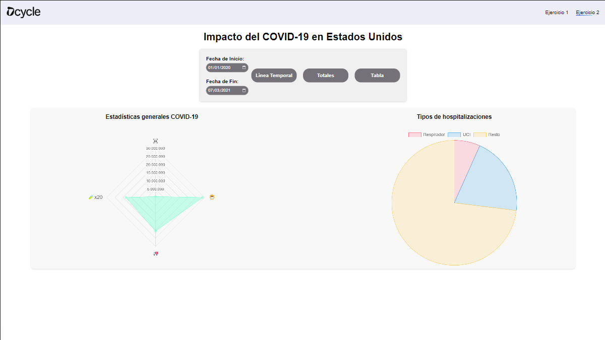
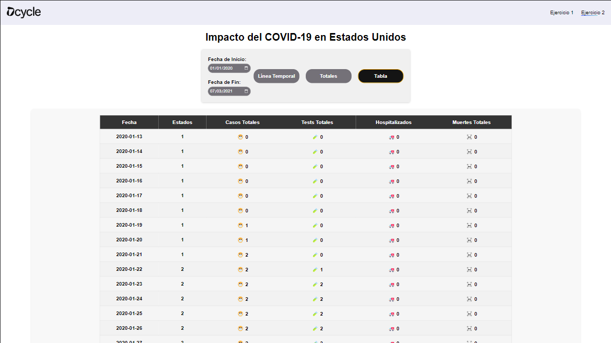

# Solución para el Proyecto de Prueba Técnica

Este repositorio contiene la solución para los ejercicios del proyecto de prueba técnica para DCycle. El proyecto está desarrollado en ReactJS y consta de dos ejercicios que involucran la interacción con un backend de Node.js y la visualización de datos relacionados con el género, nacionalidades, edades y estadísticas del COVID-19 en Estados Unidos.

## Configuración del Proyecto

1. **Clonar el Repositorio**:
   ```shell
   git clone git clone https://github.com/AlejandroMarques/dcycle.git
   ```
2. **Instalar Dependencias**:
   ```shell
   npm install
   ```
3. **Configurar el .env**:
   ```
   REACT_APP_APIURL={URL del backend}
   ```
4. **Iniciar la Aplicación**:
   ```shell
   npm start
   ```
   La aplicación se ejecutará en el puerto 3000.

## Ejercicio 1: Información Personal

Para este ejercicio, se ha creado un formulario que permite a los usuarios ingresar su nombre. Luego, se llaman a los tres endpoints del backend en el puerto 3200 para obtener información relacionada con el nombre, incluyendo el género más probable, nacionalidades probables y edad más probable. La respuesta de la api se representa con una frase con la información del género y la edad, y un grid debajo con las nacionalidades más probables, las cuales cuentan con la bandera del país. Esas banderas se consiguen a través de la api
de flagcdn.com, en la cual indicando el código del país nos da la bandera. Para los nombres he utilizado la misma api, con la llamada `https://flagcdn.com/en/codes.json`, la cual devuelve un json con todos los códigos de países y su nombre.

### Captura de Pantalla



## Ejercicio 2: Datos del COVID-19

En este ejercicio, hemos creado componentes para visualizar datos históricos del COVID-19 en Estados Unidos. Utilizamos el endpoint `/api/covid/historical` del backend para obtener datos de casos, pruebas y muertes por día.
Se han creado varias representaciones, mostrando los datos día a día y los totales.

### Capturas de Pantalla





## Consideraciones Adicionales

- Se ha creado una barra de navegación completamente escalable a través de PagesData.js para facilitar el movimiento entre ejercicios, para ello se ha utilizado el Browser Router
- Los componentes se han diseñado de manera que la información sea fácilmente comprensible para los usuarios.
- Para la creación de los gráficos del ejercico 2 se ha utilizado la libreria react-chartjs-2

## Autor

Este proyecto fue desarrollado por Alejandro Marqués.